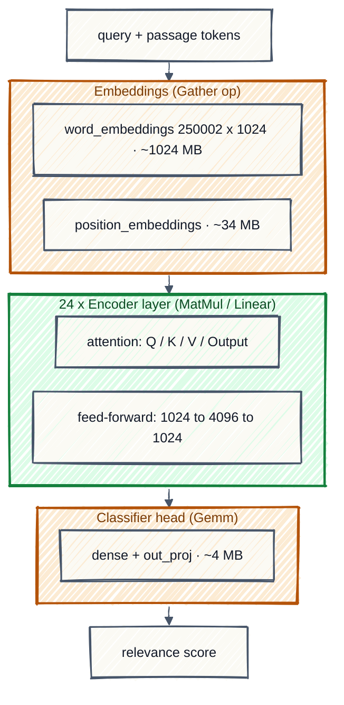
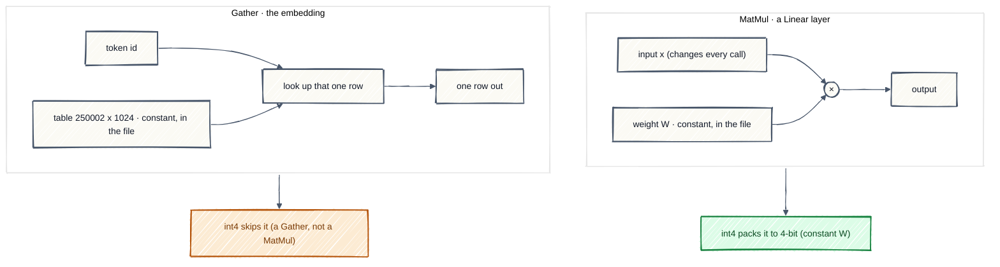
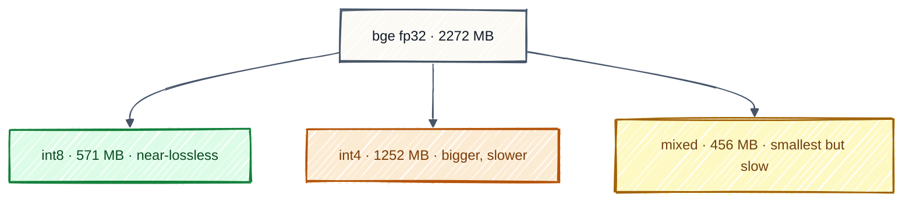

> **TL;DR:** I quantized `bge-reranker-v2-m3` (568M params) for CPU serving. int8 made it 4x smaller with no loss on hit@1 or MRR. Then int4, which was supposed to be smaller still, came back 2.2x *bigger* than int8, slower, and a touch less accurate. The reason, once I stopped blaming my own script and read the tensors: the int4 tool (`MatMulNBitsQuantizer`) only quantizes `MatMul` ops, and about 45% of this model is a 1 GB word-embedding `Gather` table it never touches. Size and accuracy are essentially the same on any hardware. Latency is the only thing that depends on the chip, and on a GPU it could flip. Bottom line after testing every option: int8 is the sweet spot, and the one build smaller than it (a mixed int8-embedding, int4-Linear model at 456 MB, which I built and measured) is also slower, so it only pays off under a hard RAM ceiling.

| precision | size on disk | hit@1 | MRR | latency (CPU) |
|---|--:|--:|--:|--:|
| fp32 | 2272 MB | 0.667 | 0.751 | 4766 ms/q |
| int8 | 571 MB | 0.667 | 0.757 | 3664 ms/q |
| int4 | 1252 MB | 0.633 | 0.731 | 8719 ms/q |

---

## The setup

`bge-reranker-v2-m3` is the strongest reranker we tested and also the most annoying to ship: 2.2 GB in fp32, onto production boxes that are CPU-only. int8 took care of that. Four times smaller, and the headline quality numbers barely moved. So int4 felt like free money. Half the bits, half the size.

I ran it expecting something around 300 MB. I got 1.25 GB. The file was bigger, the model was slower, and accuracy had slipped. My first thought was that I had broken my own measuring script, which is almost always the right first thought. I had not. Here is what was actually going on.

## Quantization in one minute

Skip this if you quantize models for a living. A model is mostly big tables of numbers we call weights, stored by default as 32-bit floats. Quantization keeps the numbers but writes them in fewer bits:

| format | bytes/weight | vs fp32 (theory) |
|---|--:|--:|
| fp32 | 4 | 1x |
| int8 | 1 (+ scale) | ~4x smaller |
| int4 | ~0.6 (4-bit + block scale) | ~6-8x smaller |

The word doing all the work in that last column is "theory". You only get the saving on the weights the tool actually rewrites, and not every tool rewrites the same parts of the model. That, it turns out, is the whole plot.

*Learn more: [HF quantization concepts](https://huggingface.co/docs/optimum/concept_guides/quantization) [1] · [A Survey of Quantization Methods for Efficient NN Inference (Gholami et al., 2021)](https://arxiv.org/abs/2103.13630) [2]*

## What bge is made of

To see why, you have to look at what the model is built from. `bge-reranker-v2-m3` is a multilingual cross-encoder, fine-tuned from the `BAAI/bge-m3` foundation model rather than a vanilla XLM-RoBERTa-large. It does sit on that XLM-RoBERTa-large backbone (the graph is full of `roberta.*` tensors, a 250k SentencePiece vocab, and an 8194-row position table, so roughly an 8192-token context), and that backbone is all that matters for this post. Three kinds of weight-carrying layers matter, and the important bit is that they run on different underlying operations. A quantizer keys off the operation, not off how big the weight is, and that gap is where the whole thing goes sideways.



Green is a `MatMul`, so int4's MatMul-only quantizer shrinks it. Amber is a `Gather` or a `Gemm`, which int4 leaves alone, and one of those amber boxes is the 1 GB embedding. int8 shrinks all of it.

*Learn more: [XLM-R: Unsupervised Cross-lingual Representation Learning at Scale (arXiv:1911.02116)](https://arxiv.org/abs/1911.02116) [3] · [BGE-M3 (arXiv:2402.03216)](https://arxiv.org/abs/2402.03216) [4] · [bge-reranker-v2-m3 model card](https://huggingface.co/BAAI/bge-reranker-v2-m3) [5]*

### Gather vs MatMul, and why a quantizer only sees one of them

Two things drop out of this, and they drop out for two *different* reasons. That distinction is exactly what tripped me up, so it is worth slowing down on.

Here is the rule everything hangs on: a weight-only quantizer can only touch stored constant weights. A weight is a learned matrix baked into the file. It is fixed, you know it before the model runs, so you can compress it once and expand it back when you multiply. If a number is not a stored constant, this kind of tool cannot do anything with it.

With that in hand, the MatMuls in bge fall into two piles.

The 144 that own a weight. A Linear layer is `y = x @ W`. `x` is the activation, the thing that changes with every input, and `W` is the weight, a constant sitting in the file. Each encoder layer has six of them, the Q/K/V/Output attention projections plus the two feed-forward layers, so 6 x 24 = 144. Real `W`, so these are what int4 compresses.

The 48 that do not. The heart of attention is two matmuls that multiply two live tensors together: `scores = Q @ Kᵀ` (query times key) and `context = softmax(scores) @ V` (attention times value). Q, K, V and the scores are all computed on the fly from the input, 2 per layer x 24 = 48.

```python
# MatMul (Linear): a multiply, and the weight W is what gets quantized
y = x @ W              # W: [1024, 4096] dense table, multiplied every pass

# Gather (embedding): a lookup, nothing is multiplied
row = table[token_id]  # table: [250002, 1024], just indexed by token
```

The same idea as a picture. One is a multiply the tool can rewrite, the other is a table lookup it has no rule for:



So why can't int4 shrink those 48? Because there is no weight there to shrink. Weight-only quantization knows exactly one move: take a constant matrix and store it smaller, ahead of time. But `Q·Kᵀ` and `softmax·V` multiply tensors that do not exist until a real query arrives, that are different for every input, and that never get written to disk. There is nothing sitting in the file to pre-compress. You *can* squeeze those tensors, but that is activation quantization, a different game (its static form needs calibration data; the dynamic form derives scales at runtime), and `MatMulNBits` does not play it. The nice part: those matmuls hold zero parameters. They are compute, not storage. Skipping them costs us nothing on disk, so it is the right call, not a miss.

So of the tensors that *do* own a real weight, which ones are actually in reach?

- The 144 Linear weight matrices. A MatMul with a constant weight, so yes, quantized.
- The embedding tables (word ~1 GB, position ~34 MB). Big constant tables, quantizable in principle, but they are read by a `Gather` op, and `MatMulNBits` only rewrites `MatMul`. Skipped.
- The classifier head. Constant weights too, but a `Gemm` op rather than a MatMul. Skipped, and tiny (~4 MB), so nobody cares.

And here is the sentence I wish I had understood an hour earlier. The word "skipped" is quietly doing two different jobs:

| left unquantized | has a stored weight? | why it was skipped | size cost |
|---|---|---|--:|
| 48 attention matmuls | no | activations, so nothing to quantize | ~0 (no params) |
| 200 Gather (incl. word-embedding) | yes | tool matches MatMul, not Gather | ~1 GB (the problem) |
| 2 classifier Gemm | yes | tool matches MatMul, not Gemm | ~4 MB |
| LayerNorm / bias vectors | yes, tiny | not matmuls, negligible | ~0 |

The 48 attention matmuls are skipped because they *cannot* be weight-quantized, and that is harmless, they store nothing. The 1 GB embedding is skipped because the tool does not speak its operation, even though it is a giant constant table begging to be compressed. Same word, opposite consequences, and the second one is the entire reason int4 ended up huge.

*Learn more: [ONNX `Gather` operator](https://onnx.ai/onnx/operators/onnx__Gather.html) [6] · [ONNX `MatMul` operator](https://onnx.ai/onnx/operators/onnx__MatMul.html) [7] · [`torch.nn.Embedding`](https://pytorch.org/docs/stable/generated/torch.nn.Embedding.html) [8] vs [`torch.nn.Linear`](https://pytorch.org/docs/stable/generated/torch.nn.Linear.html) [9]*

## Counting it in the actual graph

You do not have to take my word for the 144-vs-48 split. `MatMulNBitsQuantizer` rewrites a `MatMul` only when one of its inputs is a constant weight, so a quick census of the graph tells you what it will do before you run it. On bge:

| Operation | What it is in bge | count | int4 (MatMulNBits) | int8 (dynamic) |
|---|---|--:|---|---|
| MatMul *(weighted)* | Q/K/V/Output + FFN up/down, 6 Linears x 24 layers | 144 | 4-bit | int8 |
| MatMul *(activation)* | attention Q·Kᵀ and ·V, 2 x 24 layers | 48 | left fp32 | int8, quantized at runtime |
| Gather | word (250k x 1024) + position embeddings + index lookups | 200 | skipped | uint8 |
| Gemm | classifier head: dense + out_proj | 2 | skipped | int8 |

The two cells in that second row look like the same answer and are not. int4 leaves the 48 alone for good, because weight-only quantization has no stored constant to rewrite. int8 does reach them. Not by pre-compressing anything: it quantizes both live tensors on the fly, at inference time. Load the finished int8 graph and there is no `MatMul` node left in it anywhere. All 192 MatMuls and both Gemms have turned into 194 `MatMulInteger` nodes, each fed by a `DynamicQuantizeLinear`. So the two columns differ in *when* the quantization happens, not in what it costs on disk. Either way those 48 store nothing.

The quantizer even narrates itself in the logs:

```text
complete quantization of /roberta/encoder/layer.23/output/dense/MatMul with 4 bits
skip to quantize /roberta/encoder/layer.23/output/Add
skip to quantize /roberta/encoder/layer.23/output/LayerNorm/LayerNormalization
skip to quantize /classifier/dense/Gemm        # head: not a MatMul, so skipped
skip to quantize /classifier/out_proj/Gemm
```

And you can see the split coming without running anything, just by asking the graph which MatMuls own a constant:

```python
inits = {t.name for t in m.graph.initializer}
weighted = [n.name for n in m.graph.node
            if n.op_type == "MatMul" and any(i in inits for i in n.input)]
print(len(weighted))   # 144 -> the projection Linears (these get 4-bit)
                        # the other 48 MatMuls are attention (no weight) -> untouched
                        # the 1 GB embedding is a Gather -> never in this list at all
```

*Learn more: [ONNX Runtime: quantization and block-wise weight-only (MatMulNBits)](https://onnxruntime.ai/docs/performance/model-optimizations/quantization.html) [10] · [ONNX Python API overview](https://github.com/onnx/onnx/blob/main/docs/PythonAPIOverview.md) [11]*

## Where every megabyte goes

Enough theory. Here is where the bytes actually sit. Bar length is proportional to size, with fp32 (2272 MB) as full scale:

```text
fp32  ██████████████████████████████  2272 MB
int8  ████████                         571 MB
int4  █████████████████               1252 MB   <- "smaller" precision, bigger file
```

And the composition, which is really one row doing all the damage:

| model | word-embedding tensor | linear weights | total |
|---|---|---|--:|
| fp32 | `FLOAT` 1024 MB | `FLOAT` ~1210 MB | 2272 MB |
| int8 (optimum dynamic) | `UINT8` 256 MB | `INT8` 303 MB | 571 MB |
| int4 (MatMulNBits) | `FLOAT` 1024 MB (skipped) | 4-bit ~190 MB (with scales) | 1252 MB |

int4 genuinely won on the linear layers, about 190 MB (the 4-bit weights plus their block scales) against int8's 303 MB. It just never got near the part that mattered, and that untouched gigabyte of embedding is the whole gap.

### So did quantization *add* bytes? No, it just left the big one alone

This is the bit that feels impossible, so let me say it as plainly as I can: int4 never added a single byte, and it never grew past the original. It shrank. Watch the subtraction.

```text
fp32   embedding 1024 MB  +  everything else ~1248 MB (fp32)        = 2272 MB
int4   embedding 1024 MB  +  everything else  ~228 MB (compressed)  = 1252 MB
int8   embedding  256 MB  +  everything else  ~315 MB (compressed)  =  571 MB
```

int4 took the 2.2 GB model down to 1.25 GB. It compressed every linear layer it was allowed to touch, from 303 MB down to about 190 MB (4-bit weights plus their block scales). Nothing got larger, and nothing got stored twice. The tensor dump confirmed exactly one copy of the embedding, and in the int4 file that one copy is still fp32.

The only reason it reads as a blow-up is the comparison you make. int8 is smaller not because it is cleverer, but because it also compressed the one-gigabyte table that int4 walked past. So int4 did shrink. It simply ran out of things it was allowed to shrink before it ever reached the biggest one.

*Learn more: [ONNX external-data format (for models over 2 GB)](https://github.com/onnx/onnx/blob/main/docs/ExternalData.md) [12]*

## Don't trust the summary, read the tensors

I said my first instinct was a broken script. "int4 bigger than int8" is exactly the kind of result that is usually a bug in your own measurement, so before writing any of this down I opened all three files and added up every weight tensor by dtype:

```python
# Sum every initializer by dtype, without loading 2 GB of weights
import onnx
from onnx import TensorProto
itemsize = {TensorProto.FLOAT: 4, TensorProto.UINT8: 1, TensorProto.INT8: 1}

for f in ["model.onnx", "model_quantized.onnx", "model_int4.onnx"]:
    m = onnx.load(f, load_external_data=False)   # metadata only
    for t in m.graph.initializer:
        nbytes = prod(t.dims) * itemsize[t.data_type]
        # ... aggregate by t.data_type, print the biggest tensors
```

The biggest tensor in the int4 file:

```text
1024.0 MB  FLOAT  (250002, 1024)  roberta.embeddings.word_embeddings.weight
```

There it is. A full-precision gigabyte, exactly where the theory said it would be, and the on-disk sizes matched to the megabyte. Not a bug. Just arithmetic.

*Learn more: [`onnx.load` and serialization API](https://onnx.ai/onnx/api/serialization.html) [13] · [ONNX `TensorProto` data types](https://onnx.ai/onnx/api/classes.html#tensorproto) [14]*

## Was the code wrong? No, the tool was just mismatched

So, was the code wrong? No. Both calls are textbook. This is a tool-scope difference, not an int8-versus-int4 law: int8 ran a whole-model pass that quantizes every quantizable weight, embedding included; int4 ran a MatMul-only tool. Same model, two tools with different reach.

int8 was whole-model dynamic quantization through optimum and ONNX Runtime:

```python
from optimum.onnxruntime import ORTModelForSequenceClassification, ORTQuantizer
from optimum.onnxruntime.configuration import AutoQuantizationConfig

model = ORTModelForSequenceClassification.from_pretrained(NAME, export=True)
model.save_pretrained("bge-onnx")
quantizer = ORTQuantizer.from_pretrained("bge-onnx")
qconfig = AutoQuantizationConfig.avx512_vnni(is_static=False, per_channel=True)
quantizer.quantize(save_dir="bge-onnx", quantization_config=qconfig)  # MatMul AND the embedding
```

int4 was weight-only block quantization through ONNX Runtime:

```python
from onnxruntime.quantization.matmul_nbits_quantizer import MatMulNBitsQuantizer

model = onnx.load("bge-onnx/model.onnx")                 # the fp32 export
q = MatMulNBitsQuantizer(model, bits=4, block_size=32, is_symmetric=True)
q.process()                                              # only rewrites MatMul -> MatMulNBits
q.model.save_model_to_file("bge-onnx/model_int4.onnx", use_external_data_format=True)
```

The clue was in the name the whole time: `MatMul`NBitsQuantizer. It was built for LLM decoders, where the weight lives overwhelmingly in MatMul projections and the vocabulary is a rounding error by comparison. Point it at an encoder with a 250k-token multilingual vocabulary and that assumption turns upside down. The library did precisely what it promises. The mismatch was in my head, not in the code.

> **So why not 4-bit the embedding too, the way int8 did?** You can, and int8 already proved the table is quantizable. But 4 bits specifically on the embedding is the one place low-bit quantization tends to hurt the most: every token's representation comes out of that table and feeds all 24 layers, so the rounding error propagates through the whole model. That is exactly why GPTQ, AWQ and llama.cpp usually keep the embedding (and the output head) at higher precision even in an otherwise 4-bit model. The genuinely optimal size play is therefore mixed precision: int8 on the embedding, int4 on the Linears.

So I built it and measured it, instead of guessing. Two stages: int8-quantize the embedding `Gather` on its own, then run `MatMulNBits` over the Linears. It lands at **456 MB**, smaller than pure int8's 571 MB, right where the arithmetic said it would. But the measurement confirms the catch. It is as slow as int4 (8.7 s/q against int8's 3.7), because the 4-bit Linears still pay the unpack tax, and it inherits int4's accuracy dip exactly (hit@1 0.633, MRR 0.731, where int8 held both). I mean exactly. Mixed and pure int4 scored identically on all nine retrieval metrics and on every top-k fidelity bucket. The raw logits are not identical, mind you: max divergence from fp32 is 1.34 against int4's 1.319, so the int8 embedding does move the scores. It just never moves them far enough to reorder anything, because the 4-bit Linears own most of the error. So the trade is 115 MB of RAM for 2.4x worse latency and a slightly worse answer. On a CPU that is a bad deal, and pure int8 stays the sweet spot. Mixed precision only earns its keep if RAM is a hard ceiling, or on a GPU where the 4-bit Linears run fast.

Here is how I built it, if you ever do hit that RAM ceiling:

1. Export the fp32 ONNX (as above).
2. int8-quantize the embedding only: `quantize_dynamic(fp32, out, op_types_to_quantize=["Gather"], weight_type=QuantType.QUInt8)`. That turns the word-embedding table into `uint8` and leaves the Linears as plain fp32 MatMuls.
3. Run `MatMulNBitsQuantizer(bits=4)` on the result. It 4-bits the Linears and leaves the int8 embedding untouched, because a `Gather` is not a `MatMul`. Watch for one side effect: stage A also rewrites the two classifier `Gemm` nodes into MatMuls, so stage B 4-bits the head along with everything else. That is 146 `MatMulNBits` nodes here against int4's 144, which is why the head is not sitting at fp32 in this build the way it is in the pure int4 one. Four megabytes. It does not move the total.
4. Check it with `inspect_initializers.py`: embedding ~256 MB `UINT8`, Linears ~190 MB (4-bit + scales), 456 MB total.
5. Re-run accuracy and latency on the same pool. Measured here: 456 MB, hit@1 0.633, MRR 0.731, ~8.7 s/q.

*Learn more: [Optimum: ONNX Runtime quantization guide](https://huggingface.co/docs/optimum/onnxruntime/usage_guides/quantization) [15] · [ORT quantization reference](https://onnxruntime.ai/docs/performance/model-optimizations/quantization.html) [10]*

## Latency and accuracy went the wrong way too

Size was the headline, but int4 lost on the other two axes as well, so there is not even a consolation prize.

| | size | hit@1 | hit@3 | hit@5 | recall@5 | MRR | top-1 same as fp32 | latency (CPU) |
|---|--:|--:|--:|--:|--:|--:|--:|--:|
| fp32 | 2272 MB | 0.667 | 0.867 | 0.867 | 0.733 | 0.751 | — | 4766 ms |
| int8 | 571 MB | 0.667 | 0.867 | 0.867 | 0.711 | 0.757 | 28/30 | 3664 ms |
| int4 | 1252 MB | 0.633 | 0.833 | 0.867 | 0.752 | 0.731 | 25/30 | 8719 ms |

"No loss" is an easy thing to overclaim, so here is the fine print. int8 is flat on hit@1 and a hair up on MRR, but it gives back 0.022 on recall@5, and it changes the top result on 2 of the 30 questions. Near-lossless on the metrics we rank by, then. Not lossless. int4 is messier than it first looks too: it drops a question at hit@1 and another at hit@3, yet it beats fp32 on recall@3, recall@5 and recall@10. If you were picking on quality alone this would be a coin flip. Size and latency are what settle it, and those are not close.

Slower, not faster, and the reason is almost funny once you see it. Start with the silicon. A CPU has multiply units for floats, and on modern x86 it also has a native int8 dot-product instruction (that is what AVX-512 VNNI is, and arm64 has its own version). It has nothing that multiplies 4-bit numbers directly. There is simply no int4 matmul in the hardware.

So a 4-bit weight cannot go straight into a hardware multiply. ONNX Runtime's CPU kernel unpacks the 4-bit weights and applies their per-block scales inside the matmul loop (fused into the compute, not a separate full-tensor dequant), then multiplies. That unpack is still real work, because there is no native int4 multiply to fold it into: int8 skips it (the chip multiplies int8 directly), fp32 skips it (its weights were never packed), and int4 pays it on every matmul. Fusing keeps the overhead cheap on memory traffic, but it does not make it free on compute.

Then why does int4 exist at all if it adds work? Because its real prize was never compute, it is memory bandwidth. Smaller weights mean fewer bytes to haul out of memory into the compute units, and for some workloads that traffic is the bottleneck, not the arithmetic. That happens with very large models, or with big batches and long sequences where the same weights are reused across thousands of tokens, so one expensive unpack gets amortized over a giant multiply. On a GPU it is better still: fused low-bit kernels (Marlin, and the kernels behind methods like AWQ and GPTQ) do the unpack inside the matmul, so most of the bandwidth saving survives.

None of that describes us. We are reranking 20 passages on a CPU, and most of them run right up to the 512-token cap. Across 20 of those the linear layers still process thousands of token-rows and reuse every weight many times over, so the run leans compute-bound rather than bandwidth-bound. int4's smaller weights only pay off when memory traffic is the bottleneck, and here it is not. The kernel still fuses the unpack, but there is no bandwidth pressure for it to relieve. We pay the unpack cost and collect none of the payoff, so the model ends up slower than the fp32 it started from.

### The SIMD breakdown: the instruction set decides this

One level down, this is entirely a SIMD story. SIMD is the vector unit a CPU uses to do many multiply-accumulates in one instruction, and how fast a given precision runs comes down to a single question: does the chip have a native instruction for that precision, or does it have to fake it?

I ran this on an Apple M5 Pro, which reports these vector features:

```text
neon: 1           FEAT_DotProd: 1    int8 dot-product      (SDOT / UDOT)
FEAT_I8MM: 1      FEAT_BF16: 1       int8 matrix-multiply  (SMMLA), plus bf16
(no AVX / AVX-512: those are x86-only)
```

Here is the path each precision actually takes:

| precision | native SIMD multiply on x86 | on this Apple M5 Pro (arm64) | native? |
|---|---|---|---|
| fp32 | AVX2 / AVX-512 `FMA` | NEON `FMLA` | yes |
| int8 | AVX-512 VNNI (`VPDPBUSD`) | DotProd (`SDOT`) + I8MM (`SMMLA`) | yes |
| int4 | none | none | no, must expand first |

The same three paths as a picture. Notice the extra box on int4 that the other two do not have:

```mermaid
%%{init: {'look':'handDrawn','theme':'base','themeVariables':{'primaryColor':'#ffffff','primaryTextColor':'#1f2937','primaryBorderColor':'#334155','lineColor':'#475569','fontFamily':'ui-sans-serif, system-ui, sans-serif','fontSize':'13px'}}}%%
flowchart TB
  subgraph FP["fp32"]
    direction LR
    A1["float weights"] --> A2["FMA (NEON / AVX)"] --> A3["result"]
  end
  subgraph I8["int8"]
    direction LR
    B1["int8 weights"] --> B2["native int8 MAC: VNNI / DotProd / I8MM"] --> B3["result"]
  end
  subgraph I4["int4"]
    direction LR
    C1["4-bit weights"] --> C2["EXPAND to float: no int4 instruction exists"] --> C3["FMA / int8 MAC"] --> C4["result"]
  end
  classDef default fill:#FBFAF4,stroke:#475569,stroke-width:1.5px,color:#111827;
  classDef extra fill:#FCEBD3,stroke:#B45309,color:#7A3B06;
  class C2 extra
```



That amber box is the whole penalty. int4 does everything fp32 and int8 do, plus an unpack the hardware cannot skip.

Here it is on a single dot product, say a row of 64 numbers times 64 weights:

- fp32 runs it as roughly 4 FMA instructions (about 16 floats each).
- int8 does it in one AVX-512 VNNI instruction, `VPDPBUSD`: all 64 int8 pairs multiplied and accumulated in a single shot. (Strictly it lands them in 16 int32 lanes, four products to a lane, so a cheap horizontal add finishes the job. Still one multiply-accumulate instruction against fp32's four.)
- int4 has no such instruction, so the CPU first expands the 64 four-bit weights to int8 (or float), then runs the int8 (or float) path above. Same multiply, plus the unpack.

So in one dot product: int8 gets a purpose-built instruction, and int4 has to borrow int8's after paying to unpack. That is the whole latency story, scaled up to a 568M-parameter model.

That table is the whole latency result. int8 is fast because there is a real instruction that multiplies int8 and accumulates into int32 in one shot, and this chip has two of them (`SDOT` and `SMMLA`). int4 has no such instruction anywhere, not on this chip and not on any x86 server, so `MatMulNBits` has to unpack the nibbles, apply the per-block scale, and then feed the result into the same int8-or-float path the baseline already used. The unpack is pure overhead stacked on a multiply that was never faster to begin with.

Two things this clears up. First, the modest 1.3x for int8 was not because arm64 lacks int8 acceleration; it plainly has it (`I8MM` is right there in the flags). It is that the workload is tiny, so we are overhead-bound rather than throughput-bound, that dynamic quantization also has to quantize the activations at runtime, and that ONNX Runtime's int8 kernels are tuned hardest for x86 AVX-512-VNNI. On an AVX-512-VNNI server the same int8 should land nearer 2 to 4x. Second, int4's density (you can pack 128 four-bit values into a 512-bit register) is a storage and bandwidth property, not a compute one. With no int4 multiply instruction, that density never becomes compute throughput on a CPU. GPUs get the payoff because they are usually bandwidth-bound and their kernels (Marlin and friends) fuse the unpack into tensor-core work. CPU kernels fuse it too, but without a native int4 multiply, and without bandwidth pressure to relieve on a workload like ours, that fusion saves memory rather than time.

*Learn more: [AVX-512 VNNI](https://en.wikipedia.org/wiki/AVX-512#VNNI) [16] · [AArch64 SIMD: NEON, DotProd, I8MM](https://en.wikipedia.org/wiki/AArch64#Extensions) [17] · [ONNX Runtime MLAS (the CPU GEMM and quant kernels)](https://github.com/microsoft/onnxruntime/tree/main/onnxruntime/core/mlas) [18]*

Less accurate too, though only just. Four bits give you 16 levels per block against int8's 256, so the rounding is blunter. It cost one question at hit@1, one at hit@3, and about 0.02 MRR, where int8 held both hit rates. Small. But "smaller precision that is somehow bigger, slower, and a little worse" is not a trade anyone signs up for.

*Learn more: [LLM.int8(): 8-bit matmul with fp16 outlier handling (arXiv:2208.07339)](https://arxiv.org/abs/2208.07339) [19] · [GPTQ: block-wise low-bit weight quantization (arXiv:2210.17323)](https://arxiv.org/abs/2210.17323) [20]*

## Is this a Mac thing? What CUDA would change

Reasonable worry, because I ran all of this on an Apple laptop:

```text
machine   : arm64  (macOS)
ort        : 1.28.0, providers = [CoreML, Azure, CPUExecutionProvider]  ->  ran on CPU
torch.cuda : False        torch.mps : True   (Apple GPU present, but I used CPU on purpose)
```

So it is worth splitting the findings into the ones that are about the model and the tool, and the ones that are about this particular chip.

| Finding | Hardware-dependent? | On our prod (x86 CPU) | On a CUDA GPU |
|---|---|---|---|
| int4 bigger than int8 (size) | No | same, 1252 > 571 MB | same |
| int8 near-lossless, int4 slight loss | No | same | same |
| int8 only ~1.3x faster | Yes | ~2 to 4x (AVX-512 VNNI) | much more |
| int4 slower than fp32/int8 | Yes | no CPU speedup (expand overhead) | flips, int4 is faster |

The two that matter do not care what you run them on. Size is decided by which tensors the tool rewrites, which is a fact about the graph, and accuracy is decided by the rounding math. Neither meaningfully changes on x86 or on a GPU (kernel and accumulation quirks aside). int4-bge is 1.25 GB and a shade less accurate wherever you run it, so the headline is not a macOS quirk.

Latency is the one that genuinely turns on the hardware, exactly as the SIMD breakdown showed: int8 rides a native instruction, int4 has none and pays to expand. On our x86 prod nodes int8 should beat the 1.3x we saw here, thanks to the wider and better-tuned AVX-512-VNNI path, landing nearer 2 to 4x. int4 is the interesting case: it is mostly a GPU technique, and on CUDA it usually flips into a win, because fused kernels hide the expand behind the matmul. We do not have a GPU, and int4 tooling has been GPU-first in practice, so that flip is not really on the table for us.

> **The catch for us:** production is CPU-only container nodes, no CUDA. The one place int4 shines, GPU inference, is exactly where we do not deploy. The win is real, it just lives in an ecosystem we are not in. On our hardware, int8 or a smaller model is the lever. (This laptop even has an Apple GPU through MPS and CoreML, but I measured on CPU on purpose, because that is what prod runs.)

*Learn more: [ONNX Runtime execution providers](https://onnxruntime.ai/docs/execution-providers/) [21] · [AWQ: activation-aware 4-bit (arXiv:2306.00978)](https://arxiv.org/abs/2306.00978) [22] · [bitsandbytes (CUDA 4-bit / nf4)](https://github.com/bitsandbytes-foundation/bitsandbytes) [23]*

## Summary: the four options, measured

One fp32 model, three ways to shrink it, three very different outcomes:



All four run on the same 30-question pool, same fp32 export. "Build" is the one step that defines each option; latency is arm64 CPU and directional.

| Option | Build (the defining step) | What it quantizes | Size | hit@1 | MRR | Latency | Verdict |
|---|---|---|--:|--:|--:|--:|---|
| fp32 | none | nothing | 2272 MB | 0.667 | 0.751 | 4766 ms | baseline |
| **int8** | ORT dynamic, whole model | embedding + Linears + head | **571 MB** | 0.667 | 0.757 | **3664 ms** | **the pick on CPU: 4x smaller, no hit@1/MRR loss, fastest** |
| int4 | `MatMulNBits(bits=4)` | Linears only (embedding stays fp32) | 1252 MB | 0.633 | 0.731 | 8719 ms | avoid: bigger than int8, slower, less accurate |
| mixed | int8 `Gather` + `MatMulNBits(bits=4)` | embedding int8, Linears int4 | 456 MB | 0.633 | 0.731 | 8672 ms | smallest, but int4-slow: only under a hard RAM ceiling |

Reading it top to bottom: int8 holds hit@1 and MRR, gives back 0.02 on recall@5, and is the fastest of the quantized options, so it wins by default. int4 loses decisively on size and speed and is a wash on quality, all because it cannot touch the 1 GB embedding. Mixed precision is the only thing smaller than int8, but it buys that 115 MB with int4's latency and int4's accuracy dip, so it is a RAM-ceiling or GPU move, not a CPU default.

## What I took away

- Quantizers match on operation, not on size. Check which ops a tool actually rewrites before you assume a bit-width will shrink the whole model. One tiny tensor dump saved me from shipping a "compressed" model that was twice as heavy as the thing it replaced.
- For a large-vocab multilingual encoder, the embedding basically is the model. About 45% of bge lives in one lookup table, so any plan that ignores it is optimizing the wrong 55%.
- int8 was already the sweet spot: 4x smaller, no loss on the metrics we rank by, and faster. int4 managed to regress on size and speed while buying nothing back on quality.
- If you truly must go below int8 on size, mixed precision is the only lever that works: int8 embedding plus int4 Linears measured 456 MB, under int8's 571. But it inherits int4's latency and int4's accuracy dip, so it is a RAM-ceiling or GPU choice, never a CPU default.
- Slowness at low bit-width is a SIMD fact, not a tuning problem. CPUs have native int8 multiply instructions (AVX-512 VNNI, ARM DotProd and I8MM) and nothing for int4, so 4-bit weights always pay an expand step before they can be multiplied. No amount of kernel tuning removes an instruction that does not exist.
- The real lever for CPU is a smaller model, not more aggressive bits. The MiniLM cross-encoder from the same benchmark, `msmarco-MiniLM-L12-en-de-v1`, is 118M params: 96M of that is the embedding (250k vocab at 384 hidden), and the transformer is only 21M. Call it 118 MB in int8, an order of magnitude under int4-bge's 1.25 GB, and small enough to sit in-process on the box we already run. Two things stop it being a straight swap. It is EN-DE only, where bge covers a hundred languages, and it is the model that retrieved this pool in the first place, so its quality delta here is an upper bound rather than a fair fight. If you need real multilingual coverage the step down is `gte-multilingual-reranker-base`, 306M params, roughly 306 MB in int8. Better than bge, nothing like an order of magnitude, and for exactly the reason this whole post is about: same 250k vocabulary, same embedding table sitting there owning most of the file. Count the embedding before you believe a parameter count.

The ladder for our case, in one line: fp32 to int8 is the free win, int4 is a regression, and a smaller model is the actual move.

*Learn more: [msmarco-MiniLM-L12-en-de-v1](https://huggingface.co/cross-encoder/msmarco-MiniLM-L12-en-de-v1) [24] · [gte-multilingual-reranker-base](https://huggingface.co/Alibaba-NLP/gte-multilingual-reranker-base) [25] · [MiniLM: deep self-attention distillation (arXiv:2002.10957)](https://arxiv.org/abs/2002.10957) [26]*

## Reproduce it

```bash
python onnx_export_quant.py                           # fp32 ONNX + int8 (optimum)
python onnx_int4_quant.py                             # int4 (ORT MatMulNBits; needs `pip install onnx_ir`)
python inspect_initializers.py                        # dtype + top tensors per model (the proof)
python onnx_int4_eval.py ab-input.json int4-out.json  # accuracy + latency on the shared pool
```

## Appendix: the whole quantization script

The four steps above are really one short flow. Here it is end to end, with comments on the parts that actually decide the outcome. The two lines that explain this entire post are the int8 quantize call (touches everything, embedding included) and the int4 quantize call (MatMul only, so it walks past the embedding).

```python
"""
Quantize bge-reranker-v2-m3 for CPU and show where the bytes end up.
Flow: fp32 ONNX export -> int8 (optimum, whole model) -> int4 (ORT MatMulNBits, MatMul only) -> size report.

    pip install "optimum[onnxruntime]" onnx onnx_ir
"""
from collections import defaultdict

import onnx
from onnx import TensorProto
from optimum.onnxruntime import ORTModelForSequenceClassification, ORTQuantizer
from optimum.onnxruntime.configuration import AutoQuantizationConfig
from onnxruntime.quantization.matmul_nbits_quantizer import MatMulNBitsQuantizer

MODEL = "BAAI/bge-reranker-v2-m3"
OUT = "bge-onnx"

# 1) Export to fp32 ONNX. This model is >2 GB, so the weights spill into a side file
#    (model.onnx_data). model.onnx itself is just the graph.
model = ORTModelForSequenceClassification.from_pretrained(MODEL, export=True)
model.save_pretrained(OUT)

# 2) int8, whole-model dynamic quantization (QOperator format).
#    KEY LINE #1: optimum's dynamic pass quantizes every quantizable weight, INCLUDING the giant
#    embedding lookup table. That is why int8 comes out ~4x smaller (2272 -> 571 MB).
quantizer = ORTQuantizer.from_pretrained(OUT)
qconfig = AutoQuantizationConfig.avx512_vnni(is_static=False, per_channel=True)  # x86 int8 target
quantizer.quantize(save_dir=OUT, quantization_config=qconfig)    # writes model_quantized.onnx

# 3) int4, weight-only block quantization.
#    KEY LINE #2: MatMulNBitsQuantizer only rewrites MatMul nodes that own a constant weight.
#    The 1 GB word-embedding is a Gather, not a MatMul, so it is left at fp32. int4 shrinks the
#    Linear layers (303 -> ~190 MB incl. scales) but the untouched embedding dominates, so the file lands at
#    1252 MB, LARGER than int8. block_size=32 is the 4-bit block; smaller block = better accuracy.
m = onnx.load(f"{OUT}/model.onnx")                              # loads the fp32 graph + external data
q = MatMulNBitsQuantizer(m, bits=4, block_size=32, is_symmetric=True)
q.process()                                                     # MatMul -> MatMulNBits (4-bit packed)
q.model.save_model_to_file(f"{OUT}/model_int4.onnx", use_external_data_format=True)

# 4) Where did the bytes go? Sum each file's weight tensors by dtype, computing size from
#    dims x itemsize so we never load the 2 GB of data. This is the step that proves the
#    embedding is the culprit: it shows up as a 1024 MB FLOAT tensor in the int4 file.
ITEMSIZE = {TensorProto.FLOAT: 4, TensorProto.FLOAT16: 2, TensorProto.UINT8: 1,
            TensorProto.INT8: 1, TensorProto.INT32: 4, TensorProto.INT64: 8}
DTYPE = {v: k for k, v in TensorProto.DataType.items()}

def nbytes(dims, dtype):
    n = 1
    for d in dims:
        n *= d
    return n * ITEMSIZE.get(dtype, 4)

for f in ["model.onnx", "model_quantized.onnx", "model_int4.onnx"]:
    graph = onnx.load(f"{OUT}/{f}", load_external_data=False).graph   # metadata only
    by_dtype, tensors = defaultdict(int), []
    for t in graph.initializer:
        b = nbytes(t.dims, t.data_type)
        by_dtype[t.data_type] += b
        tensors.append((b, t.name, DTYPE.get(t.data_type, t.data_type)))
    tensors.sort(reverse=True)
    print(f"\n{f}")
    print("  by dtype:", {DTYPE.get(k, k): f"{v/1e6:.0f}MB" for k, v in sorted(by_dtype.items(), key=lambda kv: -kv[1])})
    print(f"  biggest : {tensors[0][0]/1e6:.0f}MB  {tensors[0][2]}  {tensors[0][1]}")
```

Running it prints the byte breakdown from earlier, with `word_embeddings.weight` as the biggest tensor in all three files, still `FLOAT` in the int4 one.

## References

1. [Hugging Face Optimum: quantization concepts](https://huggingface.co/docs/optimum/concept_guides/quantization)
2. [Gholami et al., 2021, A Survey of Quantization Methods (arXiv:2103.13630)](https://arxiv.org/abs/2103.13630)
3. [Conneau et al., 2020, XLM-R (arXiv:1911.02116)](https://arxiv.org/abs/1911.02116)
4. [Chen et al., 2024, BGE-M3 (arXiv:2402.03216)](https://arxiv.org/abs/2402.03216)
5. [bge-reranker-v2-m3 model card](https://huggingface.co/BAAI/bge-reranker-v2-m3)
6. [ONNX operator: Gather](https://onnx.ai/onnx/operators/onnx__Gather.html)
7. [ONNX operator: MatMul](https://onnx.ai/onnx/operators/onnx__MatMul.html)
8. [PyTorch: torch.nn.Embedding](https://pytorch.org/docs/stable/generated/torch.nn.Embedding.html)
9. [PyTorch: torch.nn.Linear](https://pytorch.org/docs/stable/generated/torch.nn.Linear.html)
10. [ONNX Runtime: quantization and block-wise weight-only (MatMulNBits)](https://onnxruntime.ai/docs/performance/model-optimizations/quantization.html)
11. [ONNX: Python API overview](https://github.com/onnx/onnx/blob/main/docs/PythonAPIOverview.md)
12. [ONNX: external-data format (models over 2 GB)](https://github.com/onnx/onnx/blob/main/docs/ExternalData.md)
13. [ONNX: serialization API (load / save)](https://onnx.ai/onnx/api/serialization.html)
14. [ONNX: TensorProto data types](https://onnx.ai/onnx/api/classes.html#tensorproto)
15. [Hugging Face Optimum: ONNX Runtime quantization guide](https://huggingface.co/docs/optimum/onnxruntime/usage_guides/quantization)
16. [AVX-512 VNNI (Wikipedia)](https://en.wikipedia.org/wiki/AVX-512#VNNI)
17. [AArch64 SIMD: NEON, DotProd, I8MM (Wikipedia)](https://en.wikipedia.org/wiki/AArch64#Extensions)
18. [ONNX Runtime: MLAS CPU kernels](https://github.com/microsoft/onnxruntime/tree/main/onnxruntime/core/mlas)
19. [Dettmers et al., 2022, LLM.int8() (arXiv:2208.07339)](https://arxiv.org/abs/2208.07339)
20. [Frantar et al., 2022, GPTQ (arXiv:2210.17323)](https://arxiv.org/abs/2210.17323)
21. [ONNX Runtime: execution providers](https://onnxruntime.ai/docs/execution-providers/)
22. [Lin et al., 2023, AWQ (arXiv:2306.00978)](https://arxiv.org/abs/2306.00978)
23. [bitsandbytes (CUDA 4-bit / nf4)](https://github.com/bitsandbytes-foundation/bitsandbytes)
24. [msmarco-MiniLM-L12-en-de-v1 model card](https://huggingface.co/cross-encoder/msmarco-MiniLM-L12-en-de-v1)
25. [gte-multilingual-reranker-base model card](https://huggingface.co/Alibaba-NLP/gte-multilingual-reranker-base)
26. [Wang et al., 2020, MiniLM (arXiv:2002.10957)](https://arxiv.org/abs/2002.10957)

---

*Figures come from the shared evaluation pool: 30 questions, 20 candidate passages each, 512-token cap. Sizes are on-disk bytes, checked by summing every initializer in each ONNX file and comparing that back against the files themselves. Latency is arm64-local on the CPU provider and directional, not a production number. One caveat on it: the two halves were not timed in the same process. The fp32 and int8 runs warm up on two queries before the clock starts, the int4 and mixed runs do not, so those two carry a first-call penalty the others avoid. Over 30 queries at roughly 8.7 s each that is worth a percent or two, nowhere near the 2.4x gap, but it is not the same stopwatch.*


<!-- Diagrams sit on a fixed light "paper" canvas in both themes. The mermaid
     node/label text is dark, so on the site's dark background it would be
     invisible without this; the light card keeps it readable either way. -->
<style>
  .mermaid {
    background: #fbfaf4;
    border: 1px solid #e4dfce;
    border-radius: 14px;
    padding: 16px 12px;
    margin: 1.4rem auto;
    max-width: 720px;
    overflow-x: auto;
  }
  .mermaid svg { display: block; margin: 0 auto; max-width: 100%; height: auto; }
</style>

<!-- Render the mermaid diagrams above. GitHub Pages (kramdown+Rouge) emits
     ```mermaid fences as .language-mermaid code blocks and does not draw them,
     so swap each into a <pre class="mermaid"> and run mermaid from the CDN. -->
<script type="module">
  import mermaid from 'https://cdn.jsdelivr.net/npm/mermaid@11/dist/mermaid.esm.min.mjs';
  for (const block of document.querySelectorAll('.language-mermaid')) {
    const pre = document.createElement('pre');
    pre.className = 'mermaid';
    pre.textContent = block.textContent;
    block.replaceWith(pre);
  }
  mermaid.initialize({ startOnLoad: false });
  await mermaid.run();
</script>
